# ☁️ AWS Infrastructure Project — Secure VPC + EC2 + NAT Gateway


---

## 📌 Introdução

Este projeto demonstra a criação de uma infraestrutura de rede completa na AWS utilizando Amazon VPC, sub-redes públicas e privadas, Internet Gateway, NAT Gateway, tabelas de rota e instâncias EC2.

O objetivo foi simular um ambiente corporativo real com segmentação de rede, acesso seguro entre instâncias e conectividade controlada com a internet, aplicando boas práticas de arquitetura cloud.

Além da implementação, o projeto também envolveu **troubleshooting real** de rotas, conectividade SSH e validação prática de acesso externo da instância privada via NAT Gateway.

---

## 🎯 Objetivos

- Isolar recursos públicos e privados dentro de uma VPC
- Permitir acesso seguro à instância privada via Bastion Host
- Garantir saída controlada da subnet privada para a internet via NAT Gateway
- Configurar roteamento correto entre sub-redes
- Simular um ambiente cloud com padrão corporativo

---

## 🏗️ Arquitetura da Solução

> **Diagrama de arquitetura** *(sugestão: adicionar imagem do draw.io ou Lucidchart aqui)*

### Componentes Utilizados

| Componente | Configuração |
|---|---|
| VPC | cloud-infra-vpc — CIDR: 10.0.0.0/16 |
| Public Subnet | 10.0.0.0/24 |
| Private Subnet | 10.0.2.0/23 |
| Internet Gateway | Lab IGW |
| NAT Gateway | secure-web-natgw |
| Public Route Table | 0.0.0.0/0 → Internet Gateway |
| Private Route Table | 0.0.0.0/0 → NAT Gateway |
| Bastion Server | EC2 t3.micro — Public Subnet |
| Private Instance | EC2 t3.micro — Private Subnet |

---

## ☁️ Serviços AWS Utilizados

- Amazon VPC
- Amazon EC2
- Internet Gateway
- NAT Gateway
- Route Tables
- Elastic IP
- Security Groups
- EC2 Instance Connect

---

## 🚀 Etapas da Implementação

### 1. Criação da VPC

Configuração da VPC principal com CIDR `10.0.0.0/16`, DNS Hostnames habilitado e ambiente preparado para sub-redes públicas e privadas.

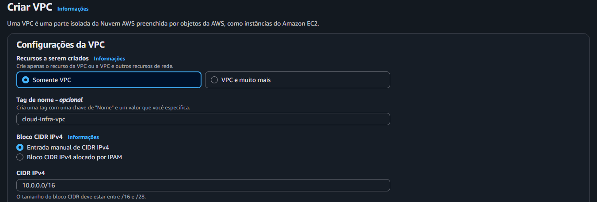
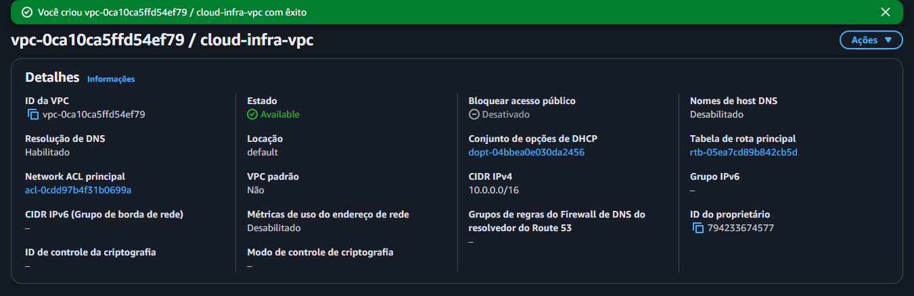

---

### 2. Criação das Sub-redes

#### Public Subnet
- CIDR: `10.0.0.0/24`
- Auto-assign Public IP: habilitado

#### Private Subnet
- CIDR: `10.0.2.0/23`
- Sem acesso direto à internet

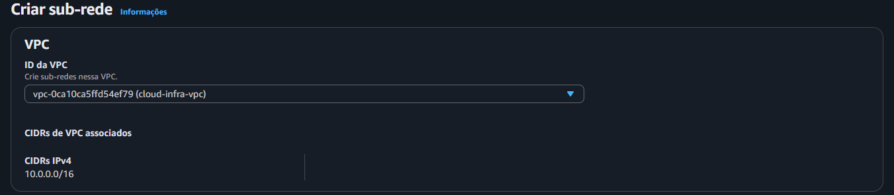
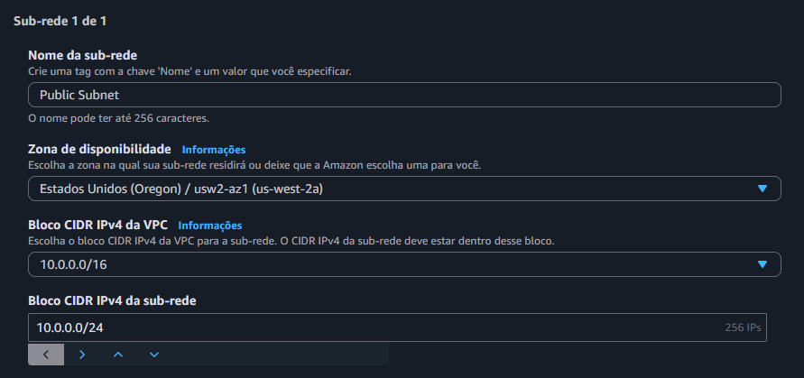
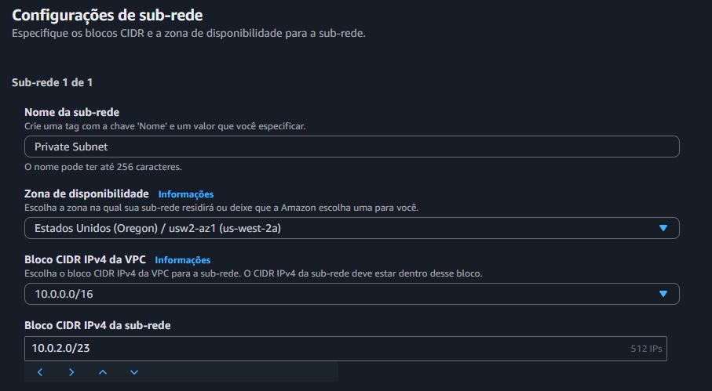
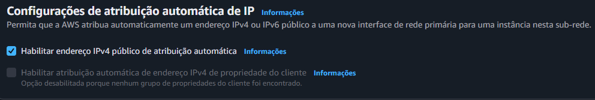

---

### 3. Internet Gateway

Criação e associação do Internet Gateway à VPC para permitir conectividade externa da subnet pública.

---

### 4. Tabelas de Rota

#### Public Route Table

Responsável pelo roteamento do tráfego externo da subnet pública:

```
0.0.0.0/0 → Internet Gateway (Lab IGW)
10.0.0.0/16 → local
```

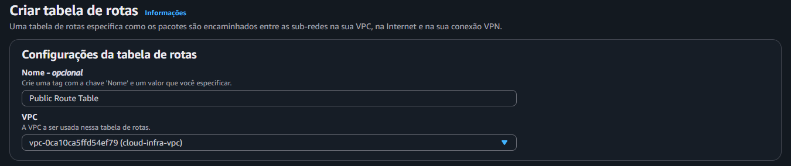
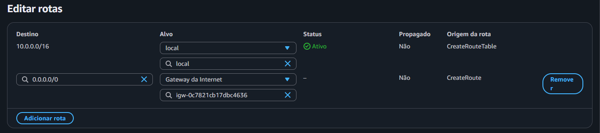
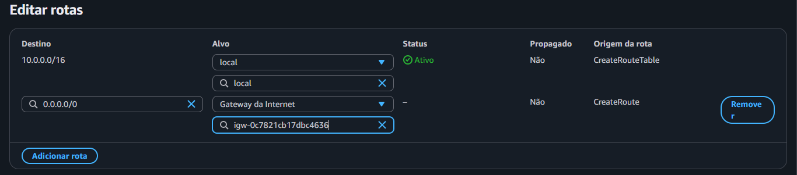


#### Private Route Table

Responsável pelo roteamento da subnet privada via NAT Gateway:

```
0.0.0.0/0 → NAT Gateway (secure-web-natgw)
10.0.0.0/16 → local
```

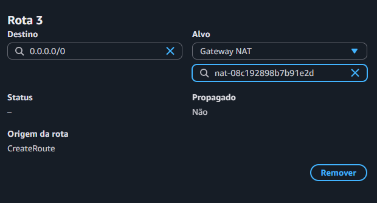
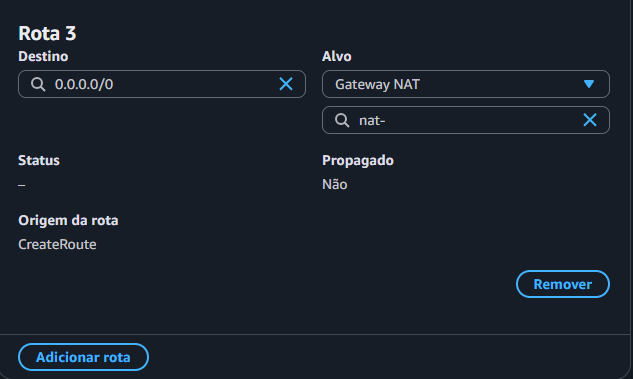
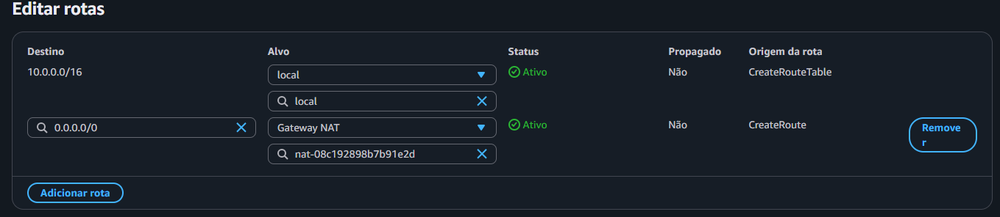

> 💡 **Tabela de referência das rotas configuradas:**


---

### 5. NAT Gateway

Criação do NAT Gateway na subnet pública com Elastic IP alocado, permitindo que a instância privada acesse a internet sem ser exposta diretamente.

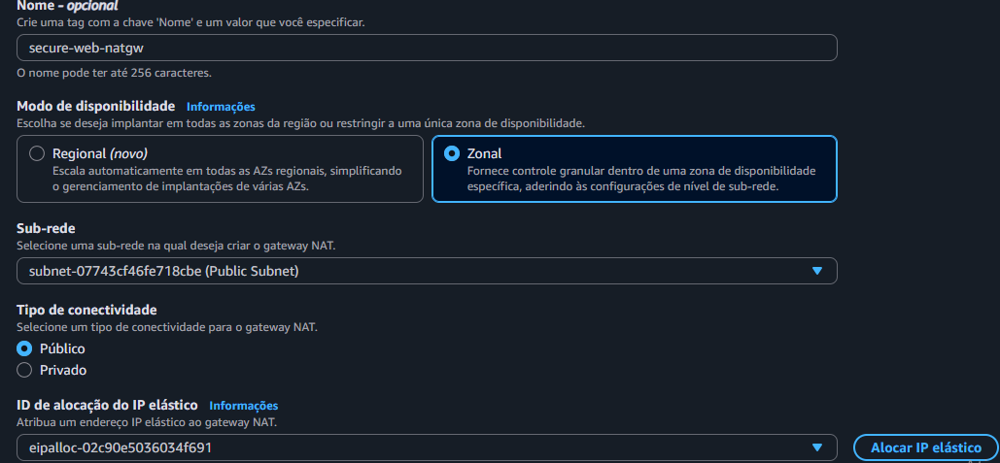

---

### 6. Bastion Server (EC2 — Public Subnet)

Instância EC2 lançada na subnet pública, configurada como ponto de acesso seguro (jump box) para a subnet privada.

| Configuração | Valor |
|---|---|
| AMI | Amazon Linux 2023 |
| Tipo | t3.micro |
| Sub-rede | Public Subnet |
| IP Público | Habilitado |
| Security Group | SSH liberado (porta 22) |
| Acesso | EC2 Instance Connect |

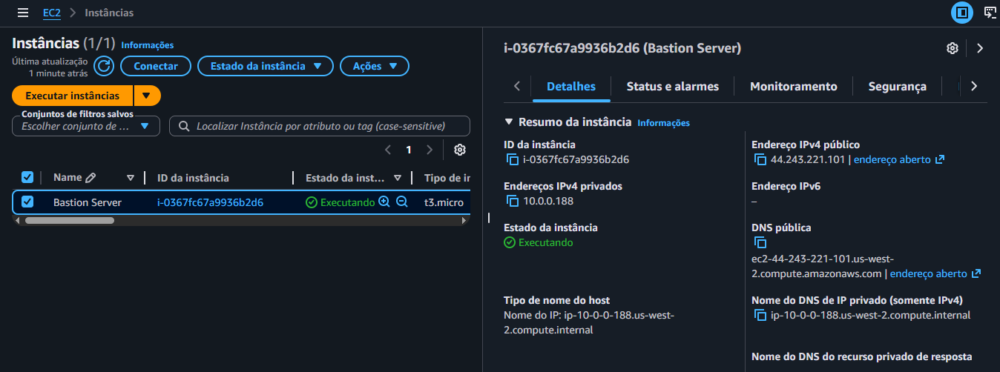

---

### 7. Private Instance (EC2 — Private Subnet)

Instância EC2 lançada na subnet privada, acessível somente via Bastion Host.

| Configuração | Valor |
|---|---|
| AMI | Amazon Linux 2023 |
| Tipo | t3.micro |
| Sub-rede | Private Subnet |
| IP Público | Desabilitado |
| Security Group | SSH liberado apenas para 10.0.0.0/16 |

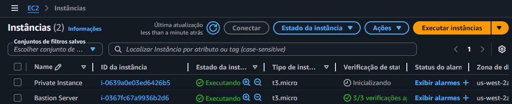

---

## 🔐 Fluxo de Acesso

```
[Usuário]
    │
    ▼
[EC2 Instance Connect]
    │
    ▼
[Bastion Server — Public Subnet 10.0.0.0/24]
    │  ssh 10.0.2.x
    ▼
[Private Instance — Private Subnet 10.0.2.0/23]
    │  via NAT Gateway
    ▼
[Internet]
```

---

## 🧪 Validação e Testes

### Teste de conectividade da instância privada com a internet

Com a instância privada acessada via Bastion, foi executado o seguinte comando para validar o acesso à internet pelo NAT Gateway:

```bash
curl -I https://amazon.com
```

**Resultado obtido:**
```
HTTP/1.1 301 Moved Permanently
Server: Server
Connection: keep-alive
```

✅ Conectividade confirmada com sucesso!

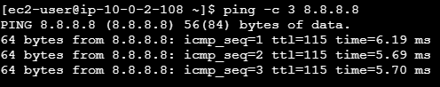

> **Observação:** O comando `ping -c 3 amazon.com` retornou 100% de packet loss pois o amazon.com bloqueia ICMP (ping) em seus servidores. Isso é comportamento esperado e não indica falha de configuração. O `curl` confirmou que a conectividade via NAT Gateway estava funcionando corretamente.

---

## 🛠️ Troubleshooting

Durante a implementação, alguns problemas foram encontrados e resolvidos:

| Problema | Causa | Solução |
|---|---|---|
| `The route 0.0.0.0/0 already exists` | Tentativa de adicionar rota duplicada | Cancelar e verificar rotas existentes antes de adicionar |
| Internet Gateway adicionado na Private Route Table | Confusão ao editar rota existente ao invés de adicionar nova | Remover a rota incorreta e adicionar IGW somente na Public Route Table |
| Duas Public Route Tables criadas | Tabela duplicada por engano | Deletar a tabela duplicada e manter somente uma com a rota correta |
| `Failed to connect` no EC2 Instance Connect | Public Route Table sem rota para o IGW | Configurar corretamente `0.0.0.0/0 → IGW` na Public Route Table |
| `ping` com 100% packet loss para amazon.com | amazon.com bloqueia ICMP nos servidores deles | Usar `curl -I` para validar conectividade — retornou HTTP 301 ✅ |

---

## 📚 Aprendizados

- Entendimento prático da diferença entre **Internet Gateway** (subnet pública) e **NAT Gateway** (subnet privada)
- Importância de associar corretamente as **tabelas de rota** a cada subnet
- Como usar um **Bastion Host** para acessar instâncias em subnets privadas com segurança
- Diferença entre bloqueio de ICMP e falha real de conectividade — validação com `curl`
- Troubleshooting de infraestrutura AWS em ambiente real

---

## 📁 Estrutura do Repositório

```
.
├── images/
│   ├── CriandoVPC1.png
│   ├── vpcCriada1.png
│   ├── CriandoSUB-Rede1.png
│   ├── PublicSUBNet1.png
│   ├── PrivateSUBNet1.png
│   ├── IPAutomatico.png
│   ├── CriandoTabelaDeRota1.png
│   ├── EditarRotasGateway.png
│   ├── TabelaDeRotasGatewaydaInternet.png
│   ├── RotaGatewayDalnternet.png
│   ├── RotaGatewayNAT.png
│   ├── RotaNATGateway4.png
│   ├── RotaPrivadaNat.png
│   ├── TabeladeRota1.png
│   ├── GatewayNAT.png
│   ├── EC2BastionServer.png
│   ├── PrivateInstance.png
│   └── ping.png
└── README.md
```

---

## 👤 Autor

Feito como parte de estudos práticos em Cloud Computing — AWS.

---

*Documentação gerada com base na implementação real do laboratório AWS VPC.*
